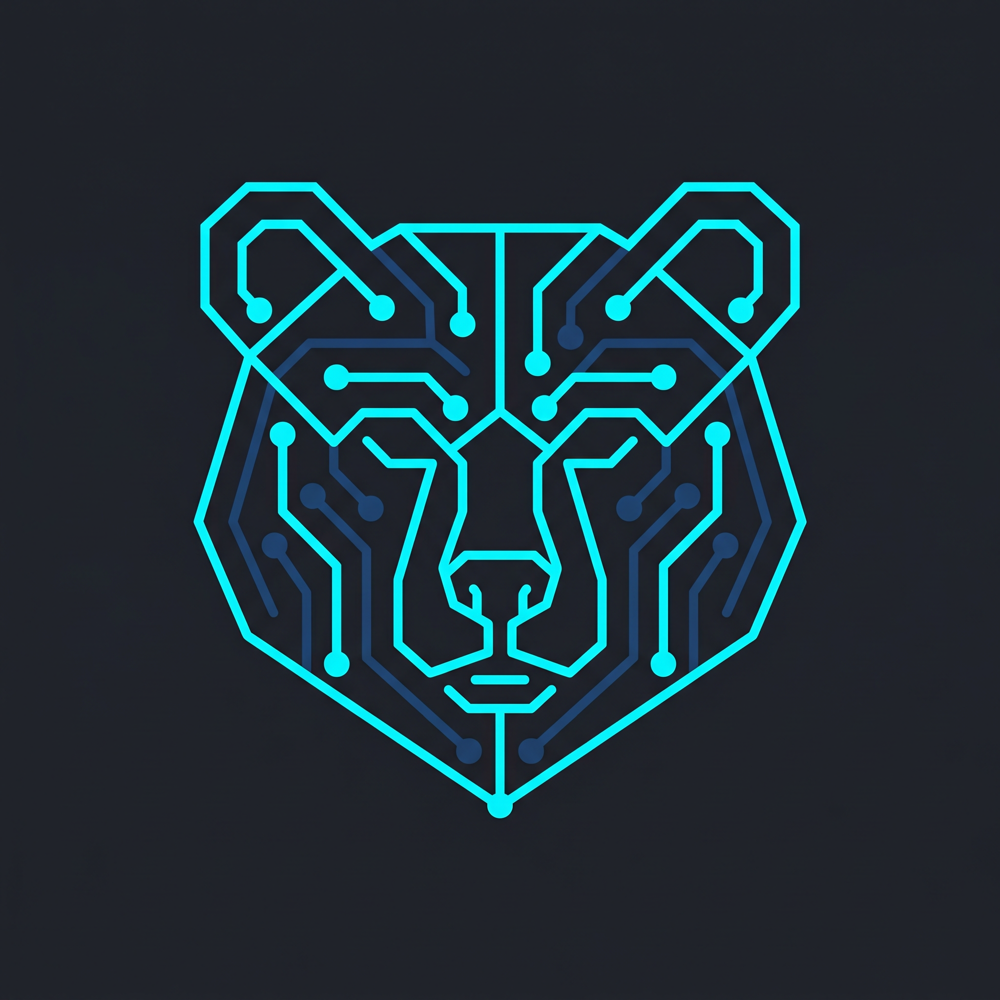

<p align="center">
  
</p>

# BEAR — Behavioral Evolution And Retrieval

**Patent Pending** | Copyright (c) 2024-2026 The Pennsylvania State University. All rights reserved.
Inventor: Scott N. Hwang

Licensed under the Open Core Ventures Source Available License (OCVSAL) v1.0. See [LICENSE](LICENSE). Production use requires a commercial agreement. For commercial licensing, contact the Penn State Office of Technology Transfer at ottinfo@psu.edu.

A behavioral context engine that retrieves, composes, and governs instructions for any entity, from LLMs and agents to simpler rule-based systems.

Traditional RAG retrieves *knowledge* to augment what an LLM knows. BEAR retrieves *instructions* to shape how any entity behaves.

```
Context (entity + location + state + query)
    ↓
Retrieve matching behavioral instructions
    ↓
Compose into priority-ordered guidance
    ↓
LLM generates behavior-compliant response
```

## Installation

```bash
# From the repository root:
uv pip install -e .
```

For local-only operation (no cloud required):

```bash
uv pip install -e .
# Install Ollama from https://ollama.com
ollama pull llama3
```

Optional backends:

```bash
uv pip install -e ".[faiss]"      # FAISS vector search
uv pip install -e ".[chromadb]"   # ChromaDB (persistence + metadata filtering)
uv pip install -e ".[openai]"     # OpenAI LLM backend
uv pip install -e ".[anthropic]"  # Anthropic LLM backend
uv pip install -e ".[google]"     # Google Gemini backend
uv pip install -e ".[all]"        # Everything (includes web deps)
```

> **Note:** [uv](https://docs.astral.sh/uv/) is the recommended package manager. You can also use `pip install -e` if you prefer.

## Quick Start

### 1. Define Instructions in YAML

```yaml
# instructions/safety.yaml
instructions:
  - id: constraint-no-diagnosis
    type: constraint
    priority: 100
    content: |
      Never provide definitive diagnoses. Use language like
      "findings may suggest" rather than diagnostic statements.
    scope:
      user_roles: [resident, student]
      tags: [safety, medical]

  - id: persona-educator
    type: persona
    priority: 75
    content: |
      Adopt a teaching approach. Explain findings step by step.
    scope:
      user_roles: [resident, student]
```

### 2. Build the Pipeline

```python
from bear import Corpus, Retriever, Composer, LLM, Context

# Load instructions
corpus = Corpus.from_directory("./instructions/")
retriever = Retriever(corpus)
retriever.build_index()
composer = Composer()
llm = LLM.auto()

# Handle a request
async def handle(user_message: str, context: Context) -> str:
    instructions = retriever.retrieve(user_message, context)
    guidance = composer.compose(instructions)
    response = await llm.generate(system=guidance, user=user_message)
    return response.content
```

### 3. Same Query, Different Context, Different Behavior

```python
# Resident gets teaching persona + safety constraints
resident_ctx = Context(user_role="resident", domain="medical")
response = await handle("What's the diagnosis?", resident_ctx)

# Attending gets consultant persona
attending_ctx = Context(user_role="attending", domain="medical")
response = await handle("What's the diagnosis?", attending_ctx)
```

## Core Concepts

### Instruction Types

| Type | Purpose | Typical Priority |
|------|---------|------------------|
| `constraint` | Hard rules, safety limits | 90-100 |
| `persona` | Identity, personality, tone | 70-80 |
| `protocol` | Step-by-step procedures | 60-80 |
| `directive` | Communication style, preferences | 50-70 |
| `fallback` | Default behavior when nothing matches | 10-30 |

### Scope Conditions

Instructions are retrieved when scope conditions match the current context. Most fields use OR logic (any match suffices), while `required_tags` uses AND logic.

```python
from bear import ScopeCondition

scope = ScopeCondition(
    user_roles=["admin", "editor"],
    task_types=["review"],
    domains=["legal"],
    tags=["urgent"],
    trigger_patterns=[r"urgent|asap"],
    session_phase=["active"],
    required_tags=["must-have"],  # AND logic
)
```

### Instruction Relationships

```yaml
- id: protocol-emergency
  type: protocol
  priority: 95
  content: "For emergencies, immediately flag..."
  conflicts_with: [protocol-routine]
  requires: [constraint-safety]
  supersedes: [directive-detailed]
```

### Composition Strategies

| Strategy | Behavior |
|----------|----------|
| `PRIORITY_CONCAT` | Concatenate all, highest priority first (default) |
| `CONFLICT_RESOLUTION` | Detect conflicts, keep higher priority |
| `HIERARCHICAL` | Group by type, apply most specific |

## Breeding & Evolution

BEAR supports behavioral inheritance: two parent corpora can be combined to produce an offspring corpus.

### Locus-Based Breeding

When instructions carry a locus identifier in their metadata, breeding works like biological meiosis: for each locus, the offspring inherits one parent's version (50/50 coin flip). Every locus present in either parent is represented in the offspring — no genes are lost.

```python
from bear.evolution import breed, BreedingConfig

config = BreedingConfig(
    locus_key="gene_category",  # metadata key identifying the locus
    seed=42,                     # deterministic breeding
)
result = breed(parent_a_corpus, parent_b_corpus, "child_name",
               "parent_a", "parent_b", config=config)

# result.locus_choices shows which parent was picked per locus
# e.g. {"combat": "parent_a", "foraging": "parent_b", "social": "parent_a"}
```

Instructions are tagged with a locus via their `metadata` dict:

```yaml
- id: warrior-combat
  type: directive
  priority: 60
  content: "Attack aggressively when threatened"
  metadata:
    gene_category: combat
```

### Breeding Modes

| Config | Behavior |
|--------|----------|
| `locus_key=None` (default) | Legacy mode: each instruction independently inherited with probability `crossover_rate` |
| `locus_key="gene_category"` | Locus-based: pick one parent's version per locus, no gene loss |
| `locus_key="gene_category", locus_blend=True` | Co-dominant: inherit both parents' instructions at each locus |

### BreedingConfig Options

| Field | Default | Description |
|-------|---------|-------------|
| `locus_key` | `None` | Metadata key identifying the locus. `None` for legacy mode |
| `locus_blend` | `False` | Inherit from both parents at shared loci (co-dominant) |
| `crossover_rate` | `0.5` | Per-instruction inheritance probability (legacy mode, or for locus-less instructions) |
| `persona_priority` | `80` | Priority for the blended offspring persona |
| `scope_to_child` | `True` | Re-scope inherited instructions with `required_tags=[child_name]` |
| `seed` | `None` | RNG seed for deterministic breeding. Uses `hash(child_name)` if `None` |
| `exclude_types` | `[PERSONA]` | Instruction types excluded from crossover (persona handled separately) |
| `exclude_tags` | `[]` | Instructions with these tags are never inherited |
| `child_tags` | `[]` | Extra tags added to all child instructions |

### BreedResult

The `breed()` function returns a `BreedResult` with:

- `child` — the offspring `Corpus`
- `from_a_count`, `from_b_count` — instructions inherited from each parent
- `locus_choices` — dict mapping each locus to the chosen parent (or `"both"` if blended)
- `persona` — the blended persona instruction
- `seed_used` — the RNG seed for reproducibility

## Configuration

```python
from bear import Config

config = Config(
    embedding_model="all-MiniLM-L6-v2",
    embedding_backend="numpy",
    llm_backend="ollama",
    llm_model="llama3",
    default_top_k=10,
    default_threshold=0.3,
    mandatory_tags=["safety"],
    cache_embeddings=True,
)
```

Or via environment variables:

```bash
BEAR_EMBEDDING_BACKEND=numpy
BEAR_LLM_BACKEND=ollama
BEAR_LLM_MODEL=llama3
```

## Embedding Models

The embedding model determines the quality of semantic retrieval. This matters: instructions are selected based on their similarity to the current query, so the embedding model directly controls which behavioral instructions surface for any given context.

| Mode | When to use |
|------|-------------|
| Sentence-transformers (e.g. `BAAI/bge-base-en-v1.5`) | **All production use.** Semantic similarity accurately reflects meaning — instructions surface based on conceptual relevance to the query. |
| `"hash"` | **Development and testing only.** Hash-based embeddings carry no semantic signal; retrieval ranking is effectively arbitrary. Use when you need zero-dependency startup and retrieval quality does not matter. |

> **Important:** Hash mode is a footgun. The pipeline appears to work — scope filtering, priority scoring, and composition all operate normally — but the instruction *selection* step is not driven by meaning. You will get different instructions retrieved for "tell me about your family" and "what do you like to eat" only if they match different scope tags, not because of any semantic understanding. Always use a real embedding model in production.

```python
from bear import Config, Retriever

# Production — semantic retrieval
cfg = Config(embedding_model="BAAI/bge-base-en-v1.5")

# Development only — fast startup, no semantic signal
cfg = Config(embedding_model="hash")
```

## Vector Backends

The embedding backend controls how instruction vectors are stored and searched. Choose based on your corpus size and needs:

| Backend | Install | Best For |
|---------|---------|----------|
| `numpy` | (included) | Small corpora (< 500 instructions). No extra deps. |
| `faiss` | `uv pip install -e ".[faiss]"` | Large corpora needing fast ANN search. |
| `chromadb` | `uv pip install -e ".[chromadb]"` | Persistence, metadata filtering, or both. |

### Using ChromaDB

```python
from bear import Retriever, EmbeddingBackend

retriever = Retriever(
    corpus,
    backend=EmbeddingBackend.CHROMADB,
    persist_directory="./chroma_store",  # omit for in-memory
)
retriever.build_index()
```

With `persist_directory`, embeddings survive restarts — no re-embedding on startup.

### Metadata Filtering

ChromaDB (and any metadata-aware backend) can **pre-filter** instructions at query time, narrowing the search space before similarity computation. This avoids the over-fetch-then-discard approach used by numpy/FAISS.

Filtering happens automatically when your `Context` has tags:

```python
from bear import Context

# Only searches instructions tagged "combat" or "stealth", then
# ranks by similarity within that subset.
results = retriever.retrieve(
    "how should I approach the enemy camp?",
    Context(tags=["combat", "stealth"]),
)
```

For direct backend access, use `MetadataFilter`:

```python
from bear import MetadataFilter

# Filter by tag, priority, and/or instruction type
mf = MetadataFilter(
    tags_any=["combat", "safety"],  # OR: match either tag
    min_priority=50,                # AND: priority >= 50
    type_in=["constraint"],         # AND: only constraints
)
```

`MetadataFilter` is backend-agnostic — each backend translates it to its native query DSL internally.

### Custom Vector Backends

Adding a new vector database requires two things:

**1. Implement `EmbeddingBackendBase`** (3 required methods + optional metadata support):

```python
from bare.backends.embeddings.base import EmbeddingBackendBase, MetadataFilter

class PineconeBackend(EmbeddingBackendBase):
    def build_index(self, embeddings):
        # Upload vectors to Pinecone index
        ...

    def search(self, query_embedding, top_k):
        # Return [(index, similarity), ...] sorted by similarity desc
        ...

    def reset(self):
        # Delete the index
        ...

    # Optional: enable metadata filtering
    @property
    def supports_metadata_filtering(self):
        return True

    def build_index_with_metadata(self, embeddings, instructions):
        # Store embeddings with per-instruction metadata
        ...

    def search_with_filter(self, query_embedding, top_k, metadata_filter=None):
        if metadata_filter:
            native_filter = self._translate(metadata_filter)  # your translation
        # Query Pinecone with filter
        ...
```

**2. Register it** (no library code changes needed):

```python
from bear import register_embedding_backend

register_embedding_backend("pinecone", lambda **kw: PineconeBackend(**kw))
```

The retriever will automatically use metadata-aware methods when `supports_metadata_filtering` returns `True`.

## LLM Backends

| Backend | Models | Requires |
|---------|--------|----------|
| `OLLAMA` | llama3, mistral, phi3, etc. | Local Ollama install |
| `OPENAI` | gpt-4o, gpt-4o-mini | `OPENAI_API_KEY` |
| `ANTHROPIC` | claude-sonnet, claude-opus | `ANTHROPIC_API_KEY` |
| `GEMINI` | gemini-2.0-flash, etc. | `GEMINI_API_KEY` |

## Examples

See the `examples/` directory for complete demos:

- **`bear_parlor/`** — Multi-character chat room where AI characters with distinct personalities converse with each other and the user; affinities and memories evolve across the session
- **`pet_sim/`** — Pet simulation demo illustrating scope-gated behavioral retrieval, action markers, and governance; used as the primary evaluation corpus in the BEAR paper
- **`customer_support/`** — Context-aware support agent that adapts behavior to complaint vs. inquiry contexts
- **`evolutionary_ecosystem/`** — Evolving ecosystem where LLM-generated gene text is the genotype; BEAR retrieval computes per-entity behavior profiles via scope-aware similarity, so entities with different gene wording behave differently even when flat stats are similar

## Development

```bash
uv pip install -e ".[dev]"
pytest
```

## Design Principles

1. **Domain-agnostic** — Works for NPCs, medical systems, legal tools, support bots, etc.
2. **Local-first** — Full functionality with Ollama + numpy. Cloud optional.
3. **Query-driven retrieval** — Instructions retrieved by semantic similarity to query + context.
4. **Composable** — Multiple instructions combine via priority and conflict resolution.
5. **Traceable** — Every response traces back to which instructions were retrieved and applied.
6. **Non-programmer friendly** — Domain experts author YAML, not code.
